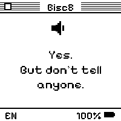

<div align="center">


# Bisc8

[](https://www.espressif.com/en/products/socs/esp32-c6)
[](https://docs.espressif.com/projects/esp-idf/)
[](#the-hardware)
[](#how-the-séance-works)
[](https://enuzzo.github.io/bisc8/)

> **A biscuit walks into your pocket and starts dispensing prophecies.**
> Hold the button, ask it anything out loud, let go. It thinks. It speaks. It prints a verse on its little grey face — and emails you the séance if you ask nicely.

</div>

Bisc8 is a black-and-white **briciomanzia** machine — *crumbomancy*, the noble art of divining fate from biscuit crumbs — crammed onto a Waveshare ESP32-C6 e-paper board roughly the size of the cookie it's cosplaying as. Press and hold the button, speak your question, release. A theatrical cookie-wizard transcribes you, consults a large language model and his own crumbs, answers out loud in a mystic-seer voice, etches a short lyrical reading onto the 1-bit panel, and — if you let it — emails you the whole performance with the audio attached.

It is not a smart speaker. Smart speakers listen all day and sell what they hear. This one listens for fifteen seconds, answers in verse, then goes back to sleep and forgets you existed. In Italian, English, or Spanish — whichever tongue you ask in.

<div align="center">

### → [**Flash it from your browser. No toolchain, no terminal.**](https://enuzzo.github.io/bisc8/) ←

**[enuzzo.github.io/bisc8](https://enuzzo.github.io/bisc8/)** — plug the biscuit in over USB-C, click one button, done.

</div>

---

## The face

The whole UI lives in one pure 1-bit, Mac-System-6 look: pinstripe title bars, a square close box, hard ink borders, glyphs built from solid rectangles so nothing ghosts or smudges on the 200×200 panel. No grayscale, no anti-aliasing, no mercy.

<div align="center">


&nbsp;&nbsp;

&nbsp;&nbsp;

&nbsp;&nbsp;


<sub><b>Status</b> · <b>Reading</b> · <b>Low power</b> · <b>Setup</b></sub>

</div>

The status and setup screens carry a QR code that drops your phone straight onto the device hotspot and the portal at `http://192.168.4.1` — because captive-portal auto-popups can't be trusted, and a QR always can.

## Why "Bisc8"?

Part *biscotto* (it is, unmistakably, a cookie). Part **8** — the figure in the crystal ball, the magic-8-ball it clearly wants to be, the infinity it pretends to channel. Part *biscate*, the Portuguese for "odd little side gig", which is exactly what fortune-telling is. Put a wizard hat on a chocolate-chip cookie, hand it a séance and a Wi-Fi stack, and you get Bisc8. If that's not crumbomancy, nothing is.

## How the séance works

Hold **BOOT**, speak, release. Bisc8 records a 16 kHz mono WAV to a dedicated raw flash `spool` partition (so a 15-second question never has to fit in RAM), then runs the full online oracle on its own TLS worker thread:

```
   🎙  hold BOOT, speak your question, let go
        │
        ▼
   [ EARS ]   whisper-1            → your words, transcribed
        │
        ▼
   [ BRAIN ]  chat-completions     → a lyrical answer, in the language you spoke
        │
        ├──▶  FACE    e-paper, ≤55 chars, full-refresh reveal (the deliberate e-ink flash beat)
        ├──▶  VOICE   TTS "coral", theatrical-seer style, 24 kHz → 16 kHz, spoken aloud
        └──▶  POST    optional email: transcript + answer + the question & answer .wav
```

No Wi-Fi? No API key? The biscuit shrugs and reaches into its offline grimoire of pre-written fortunes, so it always has *something* to say. When the network or OpenAI misbehaves, it tells you to your face with on-screen codes `E01`–`E05` instead of pretending everything's fine.

## Flash it (the easy way)

The whole point of the [**browser flasher**](https://enuzzo.github.io/bisc8/) is that there is no hard way unless you want one.

1. Open **[enuzzo.github.io/bisc8](https://enuzzo.github.io/bisc8/)** in desktop **Chrome** or **Edge**.
2. Plug the biscuit in over USB-C and hit **Flash Bisc8**. [ESP Web Tools](https://esphome.github.io/esp-web-tools/) writes the bootloader, partition table, and app at the ESP32-C6 offsets `0x0`, `0x8000`, `0x10000`. No SDK, no terminal, no `idf.py`.
3. When it reboots, join the `Bisc8-XXXX` hotspot, open `http://192.168.4.1`, and fill in Wi-Fi, language, your OpenAI key, and (optionally) an email recipient. Saving Wi-Fi tests the credentials on the spot, so you find out it's wrong *now* and not mid-prophecy.

> Public firmware images ship with **no** API keys, Wi-Fi credentials, or relay tokens baked in. The biscuit brings the theatrics; you bring your own keys.

## The hardware

| Part | Spec | Role |
|------|------|------|
| **Waveshare ESP32-C6 e-paper 1.54"** | RISC-V, 200×200 1-bit panel | The body *and* the face. Single-core, which has Opinions about timing (see the gotcha below). |
| **ES8311 codec + mic** | 16 kHz mono in, 16 kHz out | The ears and the mouth. Hears your question, voices the verdict. |
| **BOOT button** | — | The séance. Hold to ask the oracle; click for a quick offline fortune. |
| **PWR button** | — | The mortal controls. Click for Wi-Fi/status, long-press to sleep, triple-click to wipe it back to factory. |
| **16 MB flash** | 6 MB app · 5 MB `assets` · raw `spool` | Room to think, room to remember, and a scratchpad for voice WAVs. |

Idle for three minutes and Bisc8 drifts into deep sleep, wakeable by either button. A low battery (≤12%) shows a big battery glyph; at **≤10%** it writes a goodbye on screen and powers itself off completely — a cookie that knows when to stop, to spare the cell.

## Build from source

For the toolchain-curious. The ESP-IDF 5.5 toolchain and Python envs ship **in-repo** under `.espressif/` (x86_64 *and* arm64), so there's no `idf_tools.py install` ritual — point `BISC8_IDF_TOOLS_PATH` at it and let `tools/idf_env.sh` pick the env matching your host:

```sh
export BISC8_IDF_TOOLS_PATH="$PWD/.espressif"   # toolchain ships in-repo
source tools/idf_env.sh                          # auto-picks py3.9 (Intel) / py3.14 (Apple Silicon)
idf.py -C firmware/bisc8_fortune -B "$HOME/bisc8-build" build
idf.py -C firmware/bisc8_fortune -B "$HOME/bisc8-build" -p /dev/cu.usbmodemXXXX flash
```

Build to a **local** dir outside the Dropbox-synced tree — the in-tree `build/` crawls under the FUSE sync layer like everything else does.

> **The one gotcha that will bite you:** never refresh the e-ink while the mic is capturing. On the single-core C6, an e-paper refresh starves the I2S DMA and your recording stutters into gibberish. The whole display/audio architecture is built around that one rule. Respect it, and the biscuit behaves.

Run the host tests:

```sh
python -m pytest tests/        # 96 passing
```

## Design — "Bisc8 OS"

Bisc8 wears a **leisurely retro desktop OS** skin in the spirit of [POOLSUITE.NET](https://poolsuite.net) and Mac System 7/8 — pastel desktop, pinstripe title bars, square close boxes, windows, a dock — wrapped around the biscuit identity it already had: a cookie-wizard mascot, hard 2px ink borders, hard offset shadows, sharp corners. Pastel where it's playful, pure 1-bit where it's a device.

**Is it vibe coded?** Yes. **Is it random?** Absolutely not. Every tint, every shadow offset, every line-height is hand-tuned for feel. Production-grade aesthetics, prototype-grade warranty.

Typography does the heavy lifting:

| Face | Where | Credit |
|------|-------|--------|
| **ChiKareGo2** | titles, chrome, buttons | <https://www.pentacom.jp/pentacom/bitfontmaker2/gallery/?id=3780> |
| **Pixolde** | body & UI | <https://www.dafont.com/pixolde.font> |
| **ITC Garamond** | long-form copy | <https://globalfonts.pro/font/itc-garamond> |
| **Pixelify Sans** | on-device e-paper + email wordmark | <https://fonts.google.com/specimen/Pixelify+Sans> |

The first three are the **web** type system (the flasher + the captive portal). On-device — and in the email wordmark — the e-paper uses **Pixelify Sans**, baked into crisp 1-bit fonts with full Latin-1 coverage, so Italian, Spanish, and French accents survive at 200×200. We never strip an accent to fit ASCII; the oracle has standards.

## License & credits

Built by [@enuzzo](https://github.com/enuzzo) at **Netmilk Studio**. Fonts credited to their authors above. Use it, fork it, put a wizard hat on it — keep the notice, no warranty, no hard feelings.

<div align="center">

<sub><b>Bisc8</b> — briciomanzia tascabile · <i>pocket crumbomancy</i></sub>

</div>
