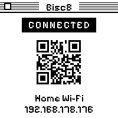
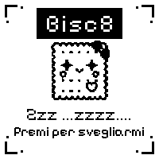
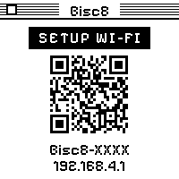

<div align="center">


# BISC8

[](https://www.espressif.com/en/products/socs/esp32-c6)
[](https://docs.espressif.com/projects/esp-idf/)
[](#hardware)
[](#how-it-works)
[](#design--bisc8-os)

> A tiny e-paper pocket oracle shaped like a biscuit. Hold the button, ask aloud, and it reads the crumbs.

</div>

---

## What it is

Bisc8 is a black-and-white **briciomanzia** machine — *crumbomancy*, the ancient art of divining fate from
biscuit crumbs — packed onto a Waveshare ESP32-C6 e-paper board the size of a cookie. Press and hold the
button, speak your question, and let go. A theatrical seer answers you out loud, prints a short verse on the
1-bit panel, and (if you ask it to) emails you the whole séance.

No app. No account. No cloud config wizard. Just a biscuit that listens, ponders, and pronounces — in Italian,
English, or Spanish, whichever you spoke in.

## Device screens

The whole UI lives in one pure 1-bit, System-6 look: striped title bars, a square close box, hard ink borders,
and glyphs drawn from solid rectangle blocks so nothing ghosts or smudges on the 200×200 panel.

<div align="center">


&nbsp;&nbsp;

&nbsp;&nbsp;


<sub><b>Status / scan to open the portal</b> &nbsp;·&nbsp; <b>Low power</b> &nbsp;·&nbsp; <b>Wi-Fi setup</b></sub>

</div>

The status screen carries a QR code that drops your phone straight onto the device hotspot and the setup portal
at `http://192.168.4.1` — because captive-portal auto-popups can't be trusted, and a QR always can.

## How it works

Hold **BOOT**, speak, release. Bisc8 records a 16 kHz mono WAV to a dedicated raw flash `spool` partition
(so a 15-second question never has to fit in RAM), then runs the full online oracle on a dedicated TLS worker:

```
   🎙  hold BOOT, speak
        │
        ▼
   [ STT ]  whisper-1   → your words
        │
        ▼
   [ BRAIN ]  chat-completions       → a lyrical answer, in the language you spoke
        │
        ├──▶  e-paper   (≤55 chars, FULL-refresh reveal — the deliberate e-ink flash beat)
        ├──▶  voice     (TTS "coral", mystical-seer style, 24 kHz → 16 kHz, played aloud)
        └──▶  email     (optional: transcript + answer + the question & answer .wav)
```

If Wi-Fi or the OpenAI key is missing, Bisc8 falls back to its offline grimoire of pre-written fortunes, so the
biscuit always has *something* to say. Failures surface as on-screen codes `E01`–`E05`.

## Flash it

The easiest path is the browser. Head to the **GitHub Pages flasher** (served from [`docs/`](docs/)), plug the
biscuit in over USB, and let [ESP Web Tools](https://esphome.github.io/esp-web-tools/) write the bootloader,
partition table, and app at the ESP32-C6 offsets `0x0`, `0x8000`, `0x10000`. No toolchain, no terminal.

After flashing, join the `Bisc8-XXXX` hotspot, open `http://192.168.4.1`, and fill in Wi-Fi, language, your
OpenAI key, and (optionally) an email recipient. Saving Wi-Fi tests the credentials on the spot.

> Public firmware images ship with **no** API keys, Wi-Fi credentials, or relay tokens baked in. You bring your own.

## Hardware

| Part | What it does |
|------|--------------|
| **Waveshare ESP32-C6 e-paper 1.54"** | RISC-V SoC + 200×200 black/white e-ink panel |
| **ES8311 codec + mic** | captures your question, voices the answer aloud |
| **BOOT button** | hold to ask · click for a random offline fortune |
| **PWR button** | click for Wi-Fi/status · long-press to sleep · triple-click to factory-reset |
| **16 MB flash** | 6 MB app · 5 MB reserved `assets` · raw `spool` for voice WAVs |

Idle for 3 minutes and Bisc8 drifts into deep sleep, wakeable by either button. A low battery (≤12%) shows a
big battery glyph; at **≤10%** Bisc8 writes it on screen and powers off completely on its own, to protect the cell.

## Build from source

The ESP-IDF 5.5 toolchain and Python envs ship **in-repo** under `.espressif/` (x86_64 *and* arm64), so there's
no `idf_tools.py install` step — just point `BISC8_IDF_TOOLS_PATH` at it and let `tools/idf_env.sh` pick the env
matching your host:

```sh
export BISC8_IDF_TOOLS_PATH="$PWD/.espressif"   # toolchain ships in-repo
source tools/idf_env.sh                          # auto-picks py3.9 (Intel) / py3.14 (Apple Silicon)
idf.py -C firmware/bisc8_fortune -B "$HOME/bisc8-build" build
idf.py -C firmware/bisc8_fortune -B "$HOME/bisc8-build" -p /dev/cu.usbmodemXXXX flash
```

Build to a **local** dir outside the Dropbox-synced tree — the in-tree `build/` crawls under the FUSE sync layer.

> **The one gotcha that will bite you:** never refresh the e-ink while the mic is capturing. On the single-core
> C6, an e-paper refresh starves the I2S DMA and your recording stutters. The whole display/audio architecture
> is built around this rule — respect it.

Run the host tests:

```sh
python -m pytest tests/        # 94 passing
```

## Design — "Bisc8 OS"

Bisc8 wears a **leisurely retro desktop OS** skin in the spirit of [POOLSUITE.NET](https://poolsuite.net) and
Mac System 7/8 — pastel desktop, pinstripe title bars, square close boxes, windows, a dock — wrapped around the
biscuit identity it already had: a cookie mascot, hard 2px ink borders, hard offset shadows, sharp corners.
Pastel where it's playful, pure 1-bit where it's a device. Vibe coded? Yes. Random? No.

Typography does the heavy lifting:

| Face | Where | Credit |
|------|-------|--------|
| **ChiKareGo2** | titles & chrome | <https://www.pentacom.jp/pentacom/bitfontmaker2/gallery/?id=3780> |
| **Pixolde** | body & UI | <https://www.dafont.com/pixolde.font> |
| **ITC Garamond** | long-form copy | <https://globalfonts.pro/font/itc-garamond> |
| **Pixelify Sans** | on-device e-paper + email wordmark | <https://fonts.google.com/specimen/Pixelify+Sans> |

The first three are the **web** type system (flasher + captive portal). On-device — and in the email wordmark —
the e-paper uses **Pixelify Sans**, baked into crisp 1-bit fonts with full Latin-1 coverage, so Italian,
Spanish, and French accents survive at 200×200. We never strip accents to fit ASCII.

## License & credits

Built by [@enuzzo](https://github.com/enuzzo). Fonts credited to their respective authors above.

<div align="center">

<sub><b>BISC8</b> — briciomanzia tascabile · <i>pocket crumbomancy</i></sub>

</div>
